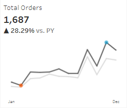

# Sales Performance

## Introduction

This user story outlines the specifications for building two dashboards using tableau to help stakeholders, including sales managers and executives to analyze sales performance and customers. 

## Sales Dashboard | Requirements

### Dashboard Purpose

The purpose of the sales dashboard is to present an overview of the sales metrics and trends to analyze year-over-year sales performance and understand sales trends.

- The Photo of Sales Dashboard

### Key Requirements

#### KPI Overview

Display a summary of total sales, profits and quantity for the current year and the previous year.

- The Photo of Total Sales

- The Photo of Total Profit

- The Photo of Total Quantity

#### Sales Trends
 – Present the data for each KPI monthly for both the current year and the previous year.
 – Identify months with highest and lowest sales and make them easy to recognize.

#### Product Subcategory Comparison
 – Compare sales performance by different product subcategories for the current year and the previous year.
 – Include a comparison of sales with profit.

- The Photo of Product Subcategory Comparison

#### Weekly Trends for Sales & Profit
 – Present weekly sales and profit data for the current year.
 – Display the average weekly values.
 – Highlight weeks that are above and below the average to draw attention to sales & profit performance.

- The Photo of Weekly Trends for Sales & Profit

## Customer Dashboard | Requirements

### Dashboard Purpose
The customer dashboard aims to provide an overview of customer data, trends and behaviors. It will help marketing teams and management to understand customer segments and improve customer satisfaction.

- The Photo of Customer Dashboard

### Key Requirements

#### KPI Overview
Display a summary of total number of customers, total sales per customer and total number of orders for the current year and the previous year.

- The Photo of Total Customers

- The Photo of Total Sales Per Customer

- The Photo of Total Orders

#### Customer Trends
 – Present the data for each KPI monthly for both the current year and the previous year.
 – Identify months with highest and lowest sales and make them easy to recognize.

#### Customer Distribution by Number of Orders
Represent the distribution of customers based on the number of orders they have placed to provide insights into customer behavior, loyalty and engagement.

- The Photo of Customer Distribution by Number of Orders

#### Top 10 Customers by Profit
 – Present the top 10 customers who have generated the highest profits for the company.
 – Show additional information like rank, number of orders, current sales, current profit and the last order date.

- The Photo of Top 10 Customers by Profit

## Design & Interactivity Requirements

### Dashboard Dynamic
 – The Dashboard should allow users to check historical data by offering them the flexibility to select any desired year.
 – Provide users with the ability to navigate between the dashboards easily.
 – Make the charts and graphs interactive, enabling users to filter data using the charts.

### Data Filters

Allow users to filter data by product information like category and subcategory and by location information like region, state and city.

- The Photo of Filters

